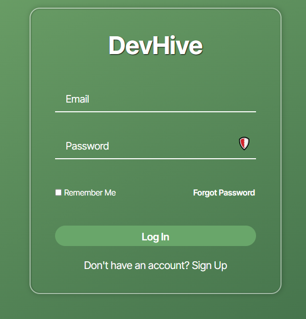
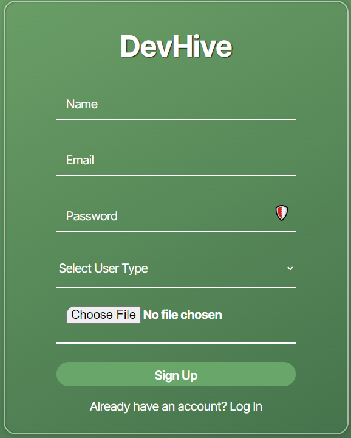
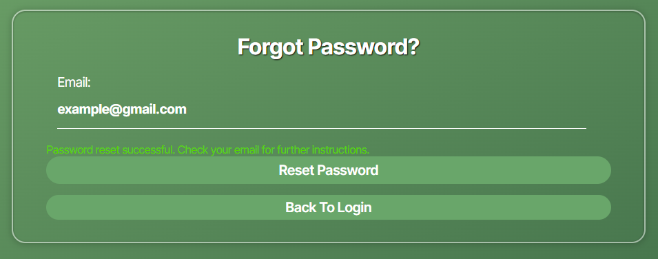
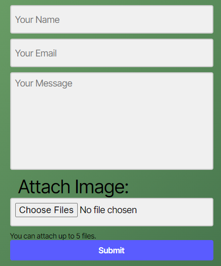

## Project-Plan
[Project-Plan](#project-plan)
  * [Pre-Development Phase (1st Day)](#pre-development-phase-1st-day)
  * [Development Phase I: Building Core Features](#development-phase-i-building-core-features)
  * [Styling & Organization Phase: Integrating Design with Functional Components](#styling--organization-phase-integrating-design-with-functional-components)
  * [Testing & Refinements Phase](#testing--refinements-phase)
  * [March 26: Final Preparations](#march-26-final-preparations)
  * [Presentation Day](#presentation-day)
- [API-Documentation](#api-documentation)
  * [Installation](#installation)
      - [npm i nodemailer (used for sending emails out in the utilities/email files)](#npm-i-nodemailer-used-for-sending-emails-out-in-the-utilitiesemail-files)
      - [npm i express-fileupload (used for attachments/files encoded in base64.)](#npm-i-express-fileupload-used-for-attachmentsfiles-encoded-in-base64)
      - [npm i @octokit/rest (Used for Github API.)](#npm-i-octokitrest-used-for-github-api)
      - [npm i react-markdown (Renders markdown in react files.)](#npm-i-react-markdown-renders-markdown-in-react-files)
      - [npm i axios (Allows to make HTTP request from nodeJS.)](#npm-i-axios-allows-to-make-http-request-from-nodejs)
      - [npm i fileUpload (used for attachments)](#npm-i-fileupload-used-for-attachments)
  * [Users](#users)
    + [Create User](#create-user)
    + [User Login](#user-login)
  * [Nodemailer must be installed](#nodemailer-must-be-installed)
      - [npm i nodemailer](#npm-i-nodemailer)
      - [in your own .env file replace GMAIL=(GMAIL LOGIN GOES HERE)](#in-your-own-env-file-replace-gmailgmail-login-goes-here)
      - [Create a gmail app pass in security settings to then replace GMAILPASS=(APP PASS KEY IN HERE) in .env.](#create-a-gmail-app-pass-in-security-settings-to-then-replace-gmailpassapp-pass-key-in-here-in-env)
    + [User Password Reset](#user-password-reset)
    + [User Password Reset](#user-password-reset-1)
    + [Utilities/email-api.js](#utilitiesemail-apijs)
    + [Customer Support](#customer-support)
    + [Utilities/email-support-api.js](#utilitiesemail-support-apijs)
    + [Get User Profile](#get-user-profile)
    + [Update User Profile](#update-user-profile)
    + [Check Token](#check-token)
    + [Follow a User](#follow-a-user)
      - [Example Request](#example-request)
      - [Example Response](#example-response)
    + [Unfollow a User](#unfollow-a-user)
      - [Example Request](#example-request-1)
      - [Example Response](#example-response-1)
  * [Posts](#posts)
    + [Create Post](#create-post)
    + [Get All Posts](#get-all-posts)
    + [Get Post by ID](#get-post-by-id)
    + [Update Post](#update-post)
    + [Delete Post](#delete-post)
    + [Like Post](#like-post)
    + [Unlike Post](#unlike-post)
## Pre-Development Phase (1st Day)

**March 9: Setup and Planning**
- Initial setup and planning phase.
- Team meeting to define roles and tasks.

## Development Phase I: Building Core Features

**March 10-13: User Authentication, User Profile, and Project Portfolio Management**
- Implement JWT authentication for user login and registration.
- Develop functionalities for users to create, update, and display profiles and portfolio projects.

**March 14-16: Social Feature Implementation, Employer Profile**
- Add abilities to like, comment, follow users, and save projects.
- Develop special views and functionalities for employer profiles.

**March 17-20: Advanced Features (Search & API Pull)**
- Implement advanced search functionalities.
- Integrate third-party APIs as required.

## Styling & Organization Phase: Integrating Design with Functional Components


**March 19-23: Begin Styling Integration**
- Focus on applying consistent styling across the application.
- Enhance user interfaces based on usability principles.

**March 20: Component, Pages, & Files Review**
- Ensure all necessary components, pages, and files are in place.

**March 20: Comprehensive README File**
- Write out a comprehensive README file detailing project setup, usage, and contribution guidelines.

**March 23: Finalize Styling Efforts and Deployment**
- Resolve any design and functionality discrepancies.
- DEPLOY the application.

## Testing & Refinements Phase

**March 20-24: Thorough Testing**
- Conduct thorough testing for all features, including UI/UX testing.
- Identify any design or functional bugs.

**March 24-25: Finalize Fixes**
- Address and fix any issues identified during testing.
- Coordinate between developers and designers for necessary adjustments.

## March 26: Final Preparations

- Conduct a final group review of the project to ensure all components work seamlessly.
- Prepare for the project presentation, ensuring all documentation is ready and the project is fully deployed.

## Presentation Day

**March 27: Presentation and Demonstration**

- Present the project, emphasizing the collaborative effort between functionality and design.
- Showcase the application's features with a focus on the enhanced user experience.
- Explain the motivation behind the app and encourage classmates to sign up.

# API-Documentation

## Installation
1. #### npm i nodemailer (used for sending emails out in the utilities/email files)
2. #### npm i express-fileupload (used for attachments/files encoded in base64.)
3. #### npm i @octokit/rest (Used for Github API.)
4. #### npm i react-markdown (Renders markdown in react files.)
5. #### npm i axios (Allows to make HTTP request from nodeJS.)
6. #### npm i fileUpload (used for attachments)

## Users

### Create User

Create a new user.

- **Request**
  - Method: `POST`
  - Endpoint: `/api/users`
  - Headers: None
  - Body:
    - `name` (required): Name of the user
    - `email` (required): Email address of the user
    - `password` (required): Password for the user
    - `userType` (optional): Type of user (developer or employer)
    - `picture` (optional): URL to the user's profile picture
    - `bio` (optional): user bio
    - `location` (optional): user location

- **Response**
  - Status Code: `200 OK`
  - Body: JSON object containing the newly created user and authentication token
  - Example:
    ```json
    {
      "user": {
        "_id": "65f50499a42ef6a2b817768d",
        "name": "John Doe",
        "email": "john.doe@example.com",
        "userType": "developer",
        "picture": "https://example.com/profile.jpg",
        "createdAt": "2024-03-10T12:00:00.000Z",
        "updatedAt": "2024-03-10T12:00:00.000Z"
      },
      "token": "<authentication_token>"
    }
    ```

### User Login

Authenticate an existing user.

- **Request**
  - Method: `POST`
  - Endpoint: `/api/users/login`
  - Headers: None
  - Body:
    - `email` (required): Email address of the user
    - `password` (required): Password for the user
    - `rememberMe` (optional): Boolean indicating whether to remember the user's session

- **Response**
  - Status Code: `200 OK`
  - Body: JSON object containing the authenticated user and authentication token (same format as the "Create User" response)




## Nodemailer must be installed
1. #### npm i nodemailer
2. #### in your own .env file replace GMAIL=(GMAIL LOGIN GOES HERE)
3. #### Create a gmail app pass in security settings to then replace GMAILPASS=(APP PASS KEY IN HERE) in .env.
##
### User Password Reset 
Authenticate an existing user.
   **Request**
  - Method: `POST`
  - Endpoint: `/api/users/reset-password`
  - Headers: None
  - Body:
    - `email` (required): Email address of the user
    - `temporaryPassword` (Created and sent in the email)
    - `temporaryToken` (Created and sent to email expires in 30 minutes)

- **Response**
  - A email sent using the npm package nodemailer
  - Status Code: `200 OK`
  - Body: JSON object containing Password reset successful. Check your email for the temporary password and token



### User Password Reset  
   **Request**
  - Method: `PUT`
  - Endpoint: `/api/users/reset-password/:token`
  - Headers: None
  - Body:
    - `newPassword`: (required): new password using the JWT token created sent to the email.
    - `token`: (required): The Link sent to the email will have the token, and the page will know to grab it to fill the value.

- **Response**
  - A email sent using the npm package nodemailer
  - Status Code: `200 OK`
  - Body: JSON object containing Password updated successfully.

### Utilities/email-api.js 
Is used for the email function nodemailer used.

### Customer Support
   **Request**
  - Method: `POST`
  - Endpoint: `/api/users/support`
  - Headers: None
  - Body:
    - `name`: Your name sent
    - `email` (required/must be in the db): Email sent to the support email and to user who inputed an email.
    - `message`: Whatever message you want added
    - `attachments`: (can add around 5 attachments)

- **Response**
  - A email sent using the npm package nodemailer
  - Status Code: `200 OK`
  - Body: JSON object containing Password updated successfully.

  

### Utilities/email-support-api.js 
Is used for the email function nodemailer used.

##
### Get User Profile

Retrieve user profile information by ID.

- **Request**
  - Method: `GET`
  - Endpoint: `/api/users/:id`
  - Headers: None
  - Parameters:
    - `id` (required): ID of the user

- **Response**
  - Status Code: `200 OK`
  - Body: JSON object containing the user profile information
  - Example:
    ```json
    {
      "_id": "65f50499a42ef6a2b817768d",
      "name": "John Doe",
      "email": "john.doe@example.com",
      "userType": "developer",
      "picture": "https://example.com/profile.jpg",
      "createdAt": "2024-03-10T12:00:00.000Z",
      "updatedAt": "2024-03-10T12:00:00.000Z"
    }
    ```

### Update User Profile

Update user profile information.

- **Request**
  - Method: `PUT`
  - Endpoint: `/api/users/:id`
  - Headers: None
  - Parameters:
    - `id` (required): ID of the user
  - Body (fields to update):
    - `name`: New name of the user
    - `email`: New email address of the user
    - `password`: New password for the user
    - `userType`: New type of user (developer or employer)
    - `picture`: New URL to the user's profile picture

- **Response**
  - Status Code: `200 OK`
  - Body: JSON object containing the updated user profile information
  - Example:
    ```json
    {
      "_id": "65f50499a42ef6a2b817768d",
      "name": "John Doe",
      "email": "john.doe@example.com",
      "userType": "employer",
      "picture": "https://example.com/new-profile.jpg",
      "createdAt": "2024-03-10T12:00:00.000Z",
      "updatedAt": "2024-03-11T08:00:00.000Z"
    }
    ```

### Check Token

Check the validity of the authentication token.

- **Request**
  - Method: `GET`
  - Endpoint: `/api/users/check-token`
  - Headers:
    - `Authorization`: Bearer token

- **Response**
  - Status Code: `200 OK`
  - Body: JSON object with a message indicating the token is valid
  - Example:
    ```json
    {
      "message": "Token is valid"
    }
    ```

### Follow a User

Allows a user to follow another user.

- **URL**: `/api/users/:userId/follow`
- **Method**: `POST`
- **Authentication required**: Yes
- **Request Parameters**:
  - `userId` (String, required): The ID of the user to follow.
  - `developerId` (String, required): The ID of the developer to follow.
- **Response**:
  - `user`: Updated user object after following.
  - `developer`: Updated developer object after being followed.

#### Example Request
```json
{
    "userId": "6123456789abcdef1234567",
    "developerId": "6123456789abcdef1234568"
}
```
#### Example Response
```json
{
    "user": {
        "_id": "6123456789abcdef1234567",
        "name": "User Name",
        "followedDevelopers": ["6123456789abcdef1234568"],
    },
    "developer": {
        "_id": "6123456789abcdef1234568",
        "name": "Developer Name",
        "usersThatFollowThisDeveloper": ["6123456789abcdef1234567"],
    }
}

```
### Unfollow a User

Allows a user to unfollow another user.

- **URL**: `/api/users/:userId/unfollow`
- **Method** : `POST`
- **Authentication required**: Yes
- **Request Parameters:
    - `userId` (String, required): The ID of the user to unfollow.
    - `developerId` (String, required): The ID of the developer to unfollow.
- **Response**:
    - `user`:Updated user object after unfollowing.
    - `developer`:Updated developer object after being unfollowed.
#### Example Request
```json
{
    "userId": "6123456789abcdef1234567",
    "developerId": "6123456789abcdef1234568"
}
```
#### Example Response
```json
{
    "user": {
        "_id": "6123456789abcdef1234567",
        "name": "User Name",
        "followedDevelopers": [],
    },
    "developer": {
        "_id": "6123456789abcdef1234568",
        "name": "Developer Name",
        "usersThatFollowThisDeveloper": [],
    }
}

```

## Posts

### Create Post

Create a new post.

- **Request**
  - Method: `POST`
  - Endpoint: `/api/posts`
  - Headers:
    - Authorization: Bearer {token}
  - Body:
    - `githubLink` (required): Link to the GitHub repository
    - `content` (required): Content of the post
    - `projectTitle` (required): Title of the project
    - `projectDescription` (required): Description of the project
    - `image` (required): URL of an image related to the project

- **Response**
  - Status Code: `201 Created`
  - Body: JSON object containing the newly created post
  - Example:
    ```json
    {
        "_id": "<Post_ID>",
        "user": "<User_ID>",
        "githubLink": "<GitHub_Link>",
        "content": "<Post_Content>",
        "projectTitle": "<Project_Title>",
        "projectDescription": "<Project_Description>",
        "image": "<Image_URL>",
        "likes": [],
        "comments": [],
        "createdAt": "<Creation_Date>",
        "updatedAt": "<Update_Date>",
        "__v": 0
    }
    ```

### Get All Posts

Retrieve all posts.

- **Request**
  - Method: `GET`
  - Endpoint: `/api/posts`
  - Headers: None

- **Response**
  - Status Code: `200 OK`
  - Body: JSON array containing all posts
  - Example:
    ```json
    [
        {
            "_id": "<Post_ID_1>",
            "user": "<User_ID_1>",
            "githubLink": "<GitHub_Link_1>",
            "content": "<Post_Content_1>",
            "projectTitle": "<Project_Title_1>",
            "projectDescription": "<Project_Description_1>",
            "image": "<Image_URL_1>",
            "likes": [],
            "comments": [],
            "createdAt": "<Creation_Date_1>",
            "updatedAt": "<Update_Date_1>",
            "__v": 0
        },
        {
            "_id": "<Post_ID_2>",
            "user": "<User_ID_2>",
            "githubLink": "<GitHub_Link_2>",
            "content": "<Post_Content_2>",
            "projectTitle": "<Project_Title_2>",
            "projectDescription": "<Project_Description_2>",
            "image": "<Image_URL_2>",
            "likes": [],
            "comments": [],
            "createdAt": "<Creation_Date_2>",
            "updatedAt": "<Update_Date_2>",
            "__v": 0
        },
    ]
    ```

### Index posts by user
Retrieves all posts created by a specific user. Used for profile pages.

- **Request**
  - Method: `GET`
  - Endpoint: `/api/posts/user/:userId`
  - Headers: None

- **Response**
  - Status Code: `200 OK`
  - Body: JSON array containing all posts

### Get Post by ID

Retrieve a specific post by its ID.

- **Request**
  - Method: `GET`
  - Endpoint: `/api/posts/:id`
  - Headers: None
  - Parameters:
    - `id` (required): ID of the post

- **Response**
  - Status Code: `200 OK`
  - Body: JSON object containing the post with the specified ID (same format as the "Create Post" response)

### Update Post

Update an existing post.

- **Request**
  - Method: `PUT`
  - Endpoint: `/api/posts/:id`
  - Headers:
    - Authorization: Bearer {token}
  - Parameters:
    - `id` (required): ID of the post to update
  - Body (fields to update):
    - Any of the fields mentioned in the "Create Post" request body

- **Response**
  - Status Code: `200 OK`
  - Body: JSON object containing the updated post (same format as the "Create Post" response)

### Delete Post

Delete an existing post.

- **Request**
  - Method: `DELETE`
  - Endpoint: `/api/posts/:id`
  - Headers:
    - Authorization: Bearer {token}
  - Parameters:
    - `id` (required): ID of the post to delete

- **Response**
  - Status Code: `200 OK`
  - Body: JSON object containing the deleted post (same format as the "Create Post" response)

### Like Post

Like a post.

- **Request**
  - Method: `POST`
  - Endpoint: `/api/posts/:id/like`
  - Headers:
    - Authorization: Bearer {token}
  - Parameters:
    - `id` (required): ID of the post to like

- **Response**
  - Status Code: `200 OK`
  - Body: JSON object containing the updated post with the user's like added

### Unlike Post

Remove a like from a post.

- **Request**
  - Method: `POST`
  - Endpoint: `/api/posts/:id/unlike`
  - Headers:
    - Authorization: Bearer {token}
  - Parameters:
    - `id` (required): ID of the post to unlike

- **Response**
  - Status Code: `200 OK`
  - Body: JSON object containing the updated post with the user's like removed
